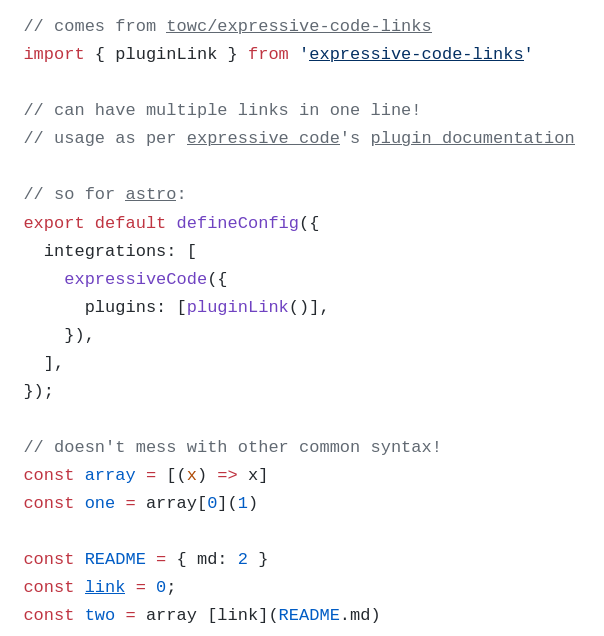

# Links

A plugin for https://expressive-code.com/

Allows you to add links to code blocks, by prepending them with `\`:

```js
// comes from \[towc/expressive-code-links](https://github.com/towc/expressive-code-links)
import { pluginLink } from '\[expressive-code-links](https://www.npmjs.com/package/expressive-code-links)'

// can have multiple links in one line!
// usage as per \[expressive code](https://expressive-code.com)'s \[plugin documentation](https://expressive-code.com/reference/configuration/#plugins)

// so for \[astro](https://astro.build/):
export default defineConfig({
  integrations: [
    expressiveCode({
      plugins: [pluginLink()],
    }),
  ],
})

// doesn't mess with other common syntax!
const array = [(x) => x]
const one = array[0](1)

const README = { md: 2 }
const \[link](README.md) = 0
const two = array [link](README.md)
```



For a live example, see https://yourweekly.dev/learn-sql-from-js#js-refresher, the astro article I wrote this plugin for.

## Customization

If you e.g. wanted the underline to look differently, you can select the link element like this:

```css
.ec-link {
  text-decoration: dotted underline;
}
```

You might need to add `!important` if something else is targeting `a` elements with higher specificity in your site.

The [mdn docs for text-decoration](https://developer.mozilla.org/en-US/docs/Web/CSS/Reference/Properties/text-decoration) are a good read for options.

## Design choices

You might already have markdown link syntax showcased in your codeblocks, and I didn't want the plugin to mess with that, which is why the actual `a` element is created by "escaping" the markdown syntax from the code block into "actual" markdown.

The color of the link is inherited from what the underlying text should be. The `a.ec-link` element is otherwise completely vanilla, for accessibility and customizability.

## Bugs

- [ ] doesn't allow escaping of the link, e.g. `\\[link](href)` still renders as `\<a href="href">link</a>`
  - not planning to implement, let me know if this affects you!
- [ ] breaks when spanning multiple elements
  - not planning to fix, let me know if you have a legitimate usecase!
- [ ] doesn't auto-detect raw links like github
  - not planning to implement. I would want to turn it off in my case.

## Contributing

I make no promises to keep this repository up to date.

You're free to create issues and PRs, but your best bet is to copy the index.ts file in your own project, if you want to make modifications.
